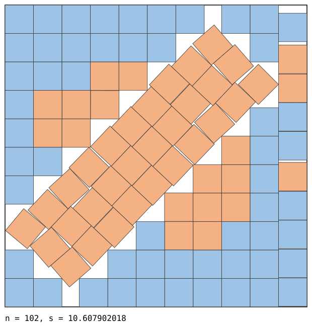

# Square packings for n = 102, 103 and 152

Packings of `n` unit squares in a square of side `s`, smaller than the best known values
in the [Friedman/Ellsworth catalogue](https://kingbird.myphotos.cc/packing/squares_in_squares.html)
(fetched 2026-09-22).

| n | previous best known | here | improvement |
|---|---|---|---|
| 102 | 10.61138794077522 | **10.60790201773** | 3.49e-3 |
| 103 | 10.70378195534368 | **10.70358345693** | 1.99e-4 |
| 152 | 12.83095954472600 | **12.83076433814** | 1.95e-4 |

Each `.txt` line is one unit square as `x y theta`, the centre and angle in radians, in a
container `[0, s]^2`.
