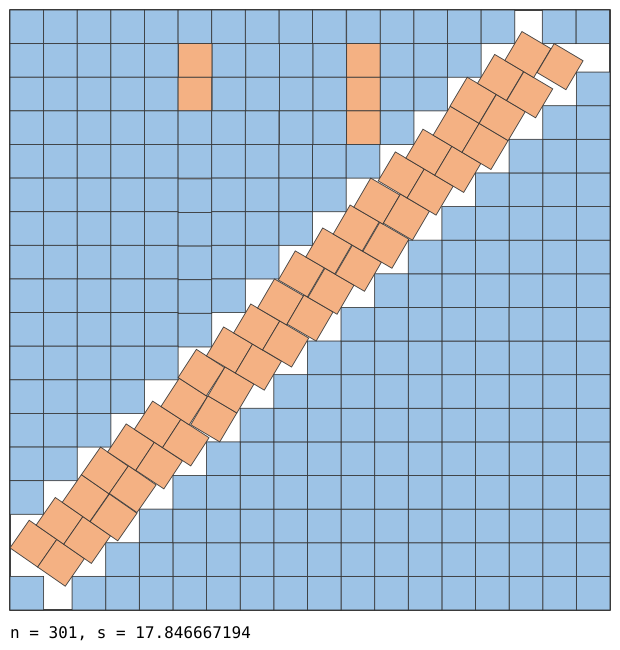
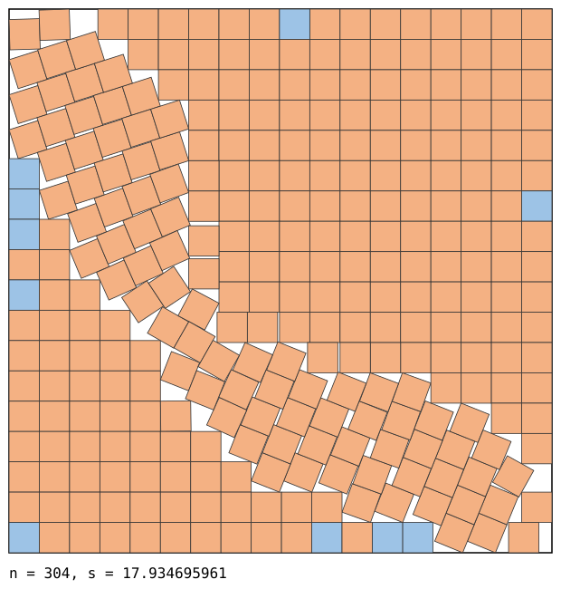
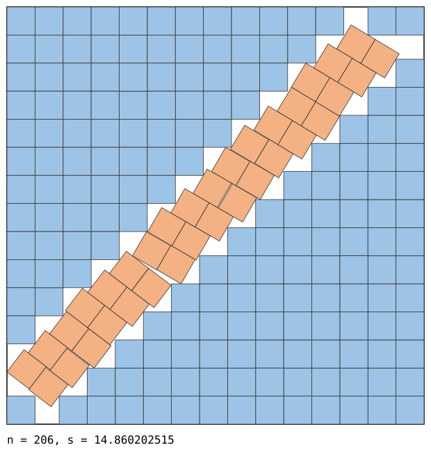
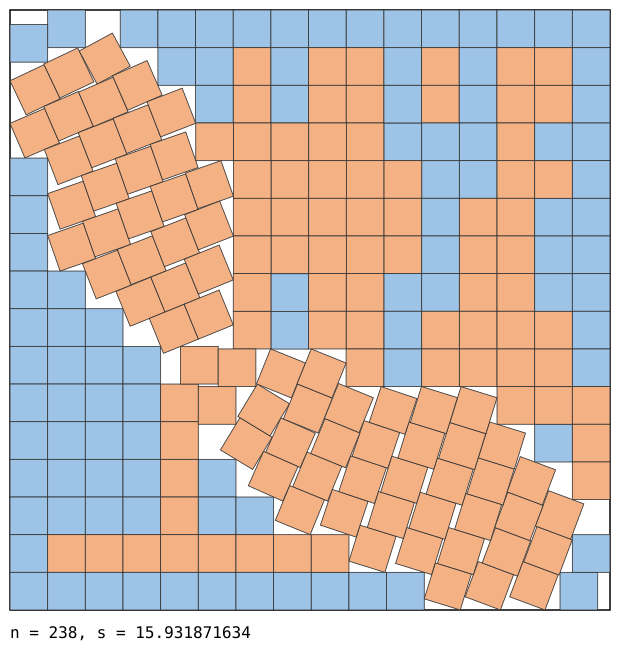
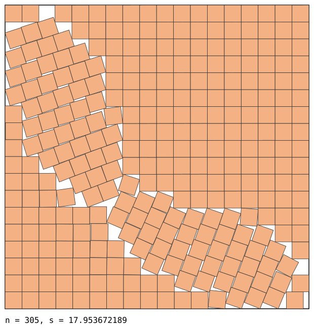

# Square packings better than the published records

Packings of `n` unit squares in a square of side `s`, each smaller than the best
known value in the [Friedman/Ellsworth catalogue](https://kingbird.myphotos.cc/packing/squares_in_squares.html)
(fetched 2026-09-25).

| n | previous best known | found here | improvement |
|---|---|---|---|
| 102 | 10.61138794077522 | **10.607896883357** | 3.491e-03 |
| 103 | 10.70378195534367 | **10.703583456926** | 1.985e-04 |
| 123 | 11.60139979378801 | **11.601386416516** | 1.338e-05 |
| 152 | 12.83095954472600 | **12.830749615781** | 2.099e-04 |
| 180 | 13.93508705291129 | **13.932235154396** | 2.852e-03 |
| 181 | 13.95690672341755 | **13.954906490905** | 2.000e-03 |
| 206 | 14.87221902560728 | **14.860202515279** | 1.202e-02 |
| 208 | 14.93776656277905 | **14.937325444624** | 4.411e-04 |
| 209 | 14.95861500087481 | **14.955093967300** | 3.521e-03 |
| 210 | 14.97413341886404 | **14.973451538510** | 6.819e-04 |
| 228 | 15.60902282132495 | **15.608961725410** | 6.110e-05 |
| 236 | 15.87607539315201 | **15.872305998655** | 3.769e-03 |
| 237 | 15.91421356237309 | **15.911195820748** | 3.018e-03 |
| 238 | 15.93965520031394 | **15.931871633680** | 7.784e-03 |
| 239 | 15.95635358406308 | **15.954154575595** | 2.199e-03 |
| 240 | 15.97556282833087 | **15.970024923644** | 5.538e-03 |
| 241 | 15.99080517810520 | **15.988725782989** | 2.079e-03 |
| 263 | 16.74264068711928 | **16.742425152344** | 2.155e-04 |
| 268 | 16.87931143465371 | **16.879077243314** | 2.342e-04 |
| 271 | 16.95499909412532 | **16.950993248039** | 4.006e-03 |
| 272 | 16.96971602419903 | **16.969110928482** | 6.051e-04 |
| 273 | 16.98820725030513 | **16.986261983468** | 1.945e-03 |
| 297 | 17.74106074604732 | **17.740432824715** | 6.279e-04 |
| 301 | 17.86889155557430 | **17.846667193939** | 2.222e-02 |
| 302 | 17.88674602860566 | **17.886045193507** | 7.008e-04 |
| 303 | 17.93125509556197 | **17.927204787911** | 4.050e-03 |
| 304 | 17.94910783564662 | **17.934847059805** | 1.426e-02 |
| 305 | 17.96066201401205 | **17.953225307010** | 7.437e-03 |
| 306 | 17.96913960675661 | **17.963835795982** | 5.304e-03 |
| 307 | 17.98272201579610 | **17.981842018536** | 8.800e-04 |

