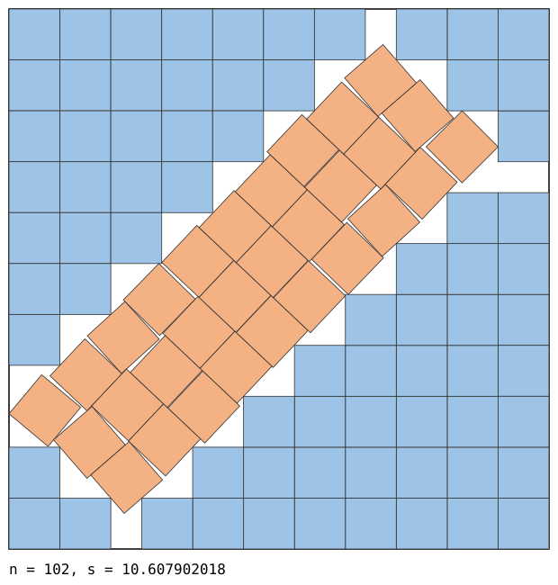
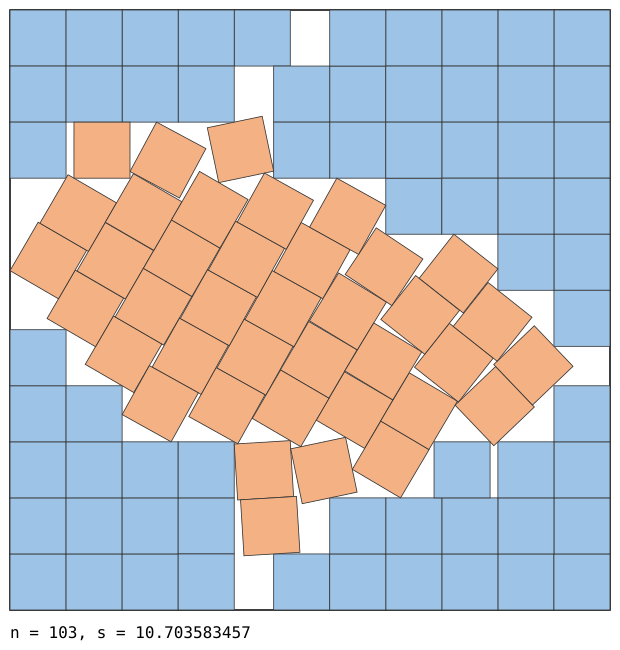
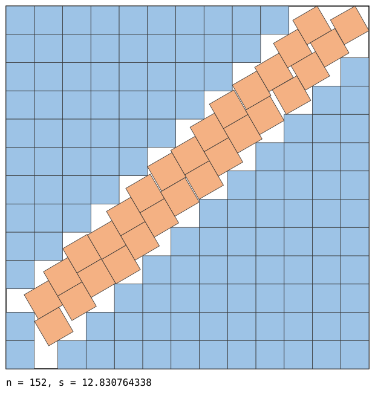
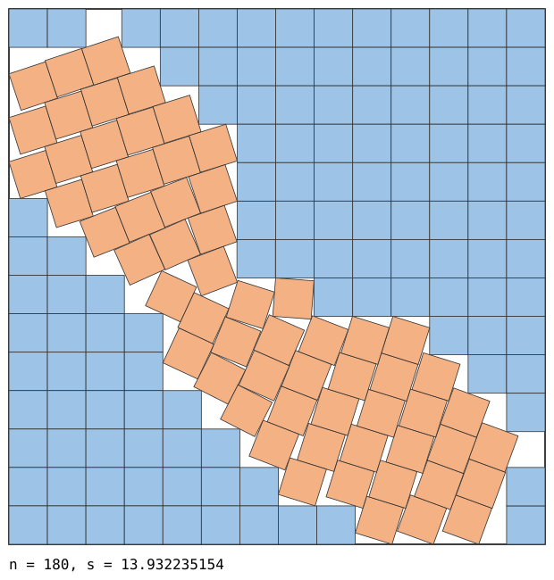
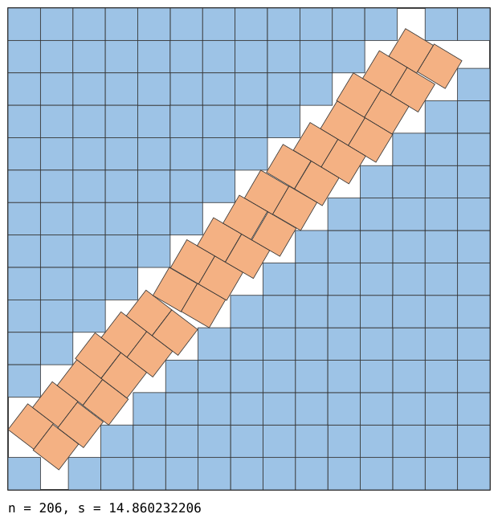

# Square packings for n = 102, 103, 152, 180 and 206

Packings of `n` unit squares in a square of side `s`, smaller than the best known values
in the [Friedman/Ellsworth catalogue](https://kingbird.myphotos.cc/packing/squares_in_squares.html)
(fetched 2026-09-22).

| n | previous best known | here | improvement |
|---|---|---|---|
| 102 | 10.61138794077522 | **10.607902017732** | 3.486e-03 |
| 103 | 10.70378195534368 | **10.703583456926** | 1.985e-04 |
| 152 | 12.83095954472600 | **12.830764338144** | 1.952e-04 |
| 180 | 13.93508705291129 | **13.932235154396** | 2.852e-03 |
| 206 | 14.87221902902620 | **14.860232206380** | 1.199e-02 |

Each `.txt` line is one unit square as `x y theta`, the centre and angle in radians, in a
container `[0, s]^2`.
