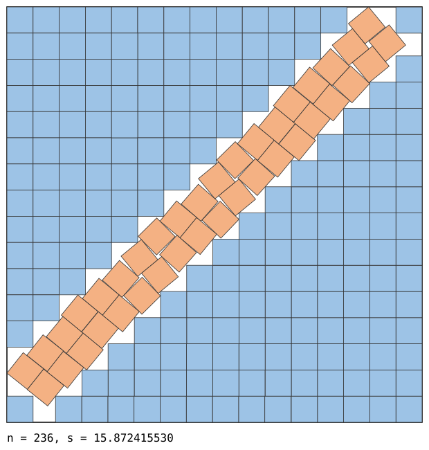

# Square packings better than the published records

Packings of `n` unit squares in a square of side `s`, each smaller than the best
known value in the [Friedman/Ellsworth catalogue](https://kingbird.myphotos.cc/packing/squares_in_squares.html)
(fetched 2026-09-22).

| n | previous best known | found here | improvement |
|---|---|---|---|
| 102 | 10.61138794077522 | **10.607902017732** | 3.486e-03 |
| 103 | 10.70378195534367 | **10.703583456926** | 1.985e-04 |
| 152 | 12.83095954472600 | **12.830764338144** | 1.952e-04 |
| 180 | 13.93508705291129 | **13.932235154396** | 2.852e-03 |
| 206 | 14.87221902902620 | **14.860202515279** | 1.202e-02 |
| 208 | 14.93776656277905 | **14.937471987089** | 2.946e-04 |
| 209 | 14.95861500087481 | **14.955093967300** | 3.521e-03 |
| 210 | 14.97413341886404 | **14.973488815181** | 6.446e-04 |
| 228 | 15.60902282132495 | **15.608976525083** | 4.630e-05 |
| 236 | 15.87607539315201 | **15.872415529525** | 3.660e-03 |
| 237 | 15.91421356237309 | **15.911196348876** | 3.017e-03 |
| 238 | 15.93965520031394 | **15.936853396900** | 2.802e-03 |
| 239 | 15.95635358406308 | **15.954681985630** | 1.672e-03 |
| 240 | 15.97556282833087 | **15.974226402939** | 1.336e-03 |
| 241 | 15.99080517810520 | **15.990091363349** | 7.138e-04 |
| 263 | 16.74264068711928 | **16.742448478819** | 1.922e-04 |
| 268 | 16.87931143465371 | **16.879116936182** | 1.945e-04 |
| 271 | 16.95499909412532 | **16.951280889236** | 3.718e-03 |
| 272 | 16.96971602419903 | **16.969484711401** | 2.313e-04 |
| 297 | 17.74106074604732 | **17.740561448945** | 4.993e-04 |
| 301 | 17.86889155557430 | **17.846667194080** | 2.222e-02 |
| 303 | 17.93125509556197 | **17.928562541014** | 2.693e-03 |
| 304 | 17.94910783564662 | **17.936633693223** | 1.247e-02 |
| 305 | 17.96066201401205 | **17.953672188875** | 6.990e-03 |
| 307 | 17.98272201579610 | **17.981999068165** | 7.229e-04 |

