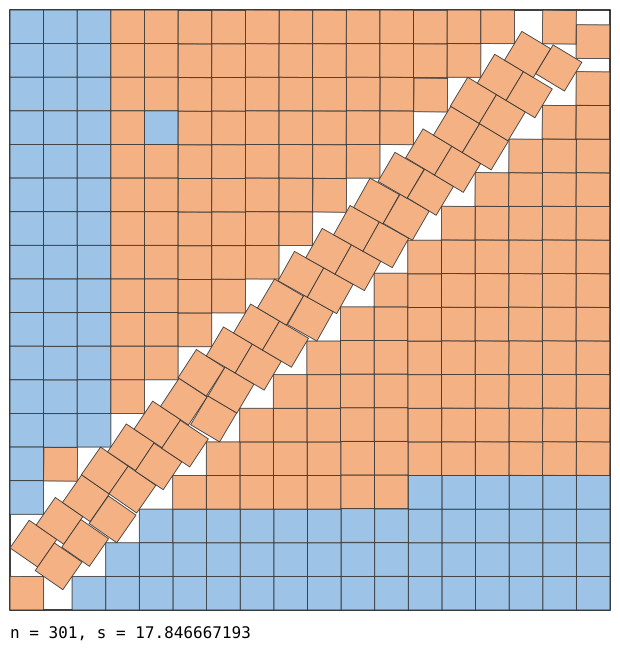
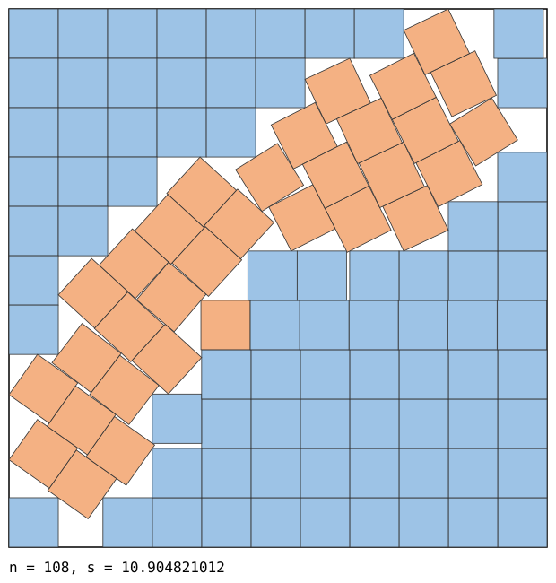
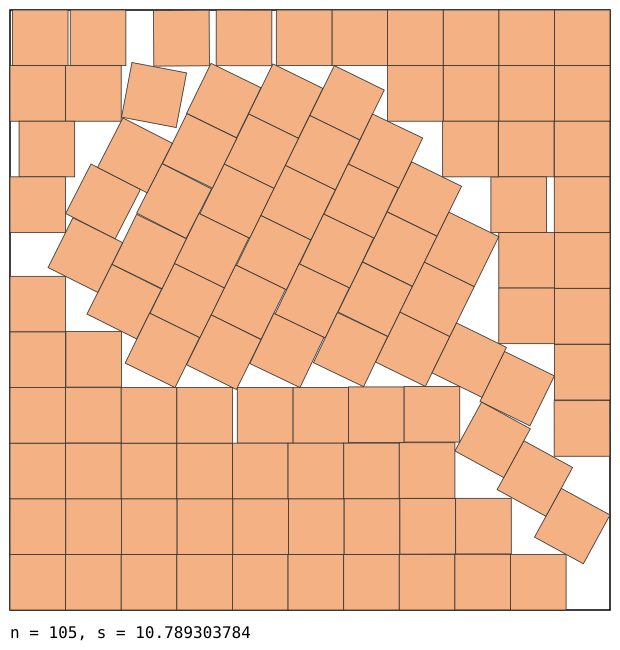
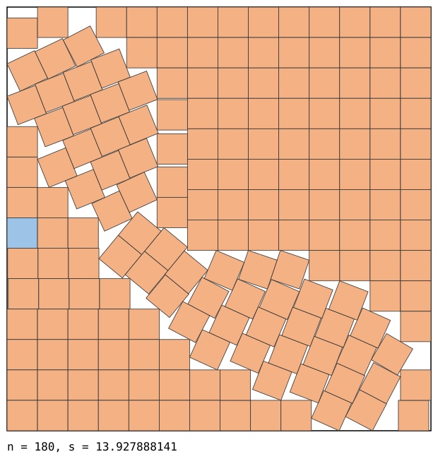
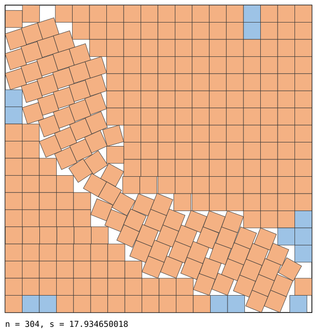

# Square packings better than the published records

Packings of `n` unit squares in a square of side `s`, each smaller than the best
known value in the [Friedman/Ellsworth catalogue](https://kingbird.myphotos.cc/packing/squares_in_squares.html)
(fetched 2026-09-25).

| n | previous best known | found here | improvement |
|---|---|---|---|
| 68 | 8.7987961402601 | **8.798795237220** | 9.030e-07 |
| 84 | 9.70710678118654 | **9.697934799017** | 9.172e-03 |
| 86 | 9.82287565553229 | **9.820535407499** | 2.340e-03 |
| 105 | 10.80761933330707 | **10.789303783750** | 1.832e-02 |
| 106 | 10.82297973416944 | **10.822908044135** | 7.169e-05 |
| 108 | 10.92591939016138 | **10.904821012322** | 2.110e-02 |
| 110 | 10.99679327401957 | **10.996783396634** | 9.877e-06 |
| 127 | 11.82287565553229 | **11.810878787591** | 1.200e-02 |
| 131 | 11.95652543280926 | **11.951105389417** | 5.420e-03 |
| 132 | 11.99137344423646 | **11.986954193643** | 4.419e-03 |
| 152 | 12.83095954472600 | **12.830718800979** | 2.407e-04 |
| 155 | 12.95844711161529 | **12.952498944016** | 5.948e-03 |
| 156 | 12.98208376048414 | **12.982082698519** | 1.062e-06 |
| 172 | 13.61898898660160 | **13.618988956902** | 2.970e-08 |
| 175 | 13.77817459305202 | **13.767155163545** | 1.102e-02 |
| 177 | 13.82302875075647 | **13.822979734172** | 4.902e-05 |
| 180 | 13.93508705291129 | **13.916993522480** | 1.809e-02 |
| 181 | 13.95690672341755 | **13.953748821957** | 3.158e-03 |
| 182 | 13.97419105332569 | **13.974090713124** | 1.003e-04 |
| 206 | 14.87221902560728 | **14.860158663395** | 1.206e-02 |
| 208 | 14.93776656277905 | **14.924518772032** | 1.325e-02 |
| 210 | 14.97413341886404 | **14.973001116590** | 1.132e-03 |
| 228 | 15.60902282132495 | **15.604601475733** | 4.421e-03 |
| 237 | 15.91421356237309 | **15.903670905584** | 1.054e-02 |
| 240 | 15.97556282833087 | **15.969685337534** | 5.877e-03 |
| 241 | 15.99080517810520 | **15.988132439528** | 2.673e-03 |
| 259 | 16.60257141234448 | **16.602568490497** | 2.922e-06 |
| 263 | 16.74264068711928 | **16.740412653803** | 2.228e-03 |
| 267 | 16.84666719284348 | **16.838815269951** | 7.852e-03 |
| 268 | 16.87931143465371 | **16.878814821010** | 4.966e-04 |
| 269 | 16.90596764828402 | **16.905967058587** | 5.897e-07 |
| 270 | 16.94062059800744 | **16.936720031124** | 3.901e-03 |
| 271 | 16.95499909412532 | **16.950820792628** | 4.178e-03 |
| 273 | 16.98820725030513 | **16.983925962654** | 4.281e-03 |
| 292 | 17.60257141234448 | **17.597249391200** | 5.322e-03 |
| 297 | 17.74106074604732 | **17.740417287547** | 6.435e-04 |
| 301 | 17.86889155557430 | **17.846667192847** | 2.222e-02 |
| 303 | 17.93125509556197 | **17.917443925498** | 1.381e-02 |
| 304 | 17.94910783564662 | **17.934650018394** | 1.446e-02 |
| 305 | 17.96066201401205 | **17.952959459019** | 7.703e-03 |
| 306 | 17.96913960675661 | **17.963433717495** | 5.706e-03 |
| 307 | 17.98272201579610 | **17.981030548637** | 1.691e-03 |

<!-- current-status -->

## Standing against the current register

The table above compares with the catalogue as fetched in September. Against the [jlevy/squares register](https://jlevy.github.io/squares/) and verified pending submissions by others (`known_best.json`, refreshed 2026-10-09): 17 best known, 24 registered, 1 tied.

| n | found here | best known elsewhere | source | status |
|---|---|---|---|---|
| 68 | 8.798795237220 | 8.798795237218 | register | **registered** (exact optimum by Seth Rehwaldt) |
| 84 | 9.697934799017 (seeded from Ryan Xu) | 9.698052060510 | register | **best known** (same packing also in [#470](https://github.com/jlevy/squares/issues/470)) |
| 86 | 9.820535407499 (seeded from Ryan Xu) | 9.820565730010 | register | **best known** (same packing also in [#470](https://github.com/jlevy/squares/issues/470)) |
| 105 | 10.789303783750 (seeded from Ryan Xu) | 10.790676575411 | register | **best known** (same packing also in [#470](https://github.com/jlevy/squares/issues/470)) |
| 106 | 10.822908044135 | 10.822908044133 | register | **registered** (exact optimum by Evan Daniel) |
| 108 | 10.904821012322 (seeded from Ryan Xu) | 10.904824785111 | register | **best known** (same packing also in [#470](https://github.com/jlevy/squares/issues/470)) |
| 110 | 10.996783396634 | 10.996783396632 | register | **registered** (exact optimum by Evan Daniel) |
| 127 | 11.810878787591 (seeded from Ryan Xu) | 11.810936647512 | register | **best known** (same packing also in [#470](https://github.com/jlevy/squares/issues/470)) |
| 131 | 11.951105389417 (seeded from Ryan Xu) | 11.951150044912 | register | **best known** (same packing also in [#470](https://github.com/jlevy/squares/issues/470)) |
| 132 | 11.986954193643 (seeded from Mishapolk) | 11.986956226077 | [Mishapolk](https://github.com/jlevy/squares/issues/470) (pending) | **best known** |
| 152 | 12.830718800979 | 12.830718800977 | register | **registered** (exact optimum by Evan Daniel) |
| 155 | 12.952498944016 (seeded from Nate Chaoweeraprasit (SQUISH)) | 12.952503202605 | register | **best known** (same packing also in [#465](https://github.com/jlevy/squares/issues/465)) |
| 156 | 12.982082698519 | 12.982082698517 | register | **registered** (exact optimum by Evan Daniel) |
| 172 | 13.618988956902 | 13.618988956899 | register | **registered** (exact optimum by Evan Daniel) |
| 175 | 13.767155163545 (seeded from Ryan Xu) | 13.768899276614 | register | **best known** (same packing also in [#470](https://github.com/jlevy/squares/issues/470)) |
| 177 | 13.822979734172 | 13.822979734169 | register | **registered** (exact optimum by Evan Daniel) |
| 180 | 13.916993522480 (seeded from Nate Chaoweeraprasit (SQUISH), precision-refined by SidG2k1) | 13.917653417450 | register | **best known** (same packing also in [#470](https://github.com/jlevy/squares/issues/470)) |
| 181 | 13.953748821957 | 13.953748821954 | register | **registered** (exact optimum by Evan Daniel) |
| 182 | 13.974090713124 | 13.974090713121 | register | **registered** (exact optimum by Evan Daniel) |
| 206 | 14.860158663395 | 14.860158663392 | register | **registered** (exact optimum by Evan Daniel) |
| 208 | 14.924518772032 | 14.924518772029 | register | tied (rounding) |
| 210 | 14.973001116590 | 14.973001116588 | register | **registered** (exact optimum by Evan Daniel) |
| 228 | 15.604601475733 | 15.604602454546 | register | **best known** |
| 237 | 15.903670905584 (seeded from Nate Chaoweeraprasit (SQUISH), precision-refined by SidG2k1) | 15.903676235189 | register | **best known** |
| 240 | 15.969685337534 | 15.969685337531 | register | **registered** (exact optimum by Evan Daniel) |
| 241 | 15.988132439528 | 15.988132439525 | register | **registered** (exact optimum by Evan Daniel) |
| 259 | 16.602568490497 | 16.602568490493 | register | **registered** (exact optimum by Evan Daniel) |
| 263 | 16.740412653803 (seeded from Nate Chaoweeraprasit (SQUISH)) | 16.740419679539 | register | **best known** |
| 267 | 16.838815269951 (seeded from Ryan Xu) | 16.838828608311 | [Mishapolk](https://github.com/jlevy/squares/issues/470) (pending) | **best known** |
| 268 | 16.878814821010 | 16.878814821007 | register | **registered** (exact optimum by Evan Daniel) |
| 269 | 16.905967058587 | 16.905967058584 | register | **registered** (exact optimum by Evan Daniel) |
| 270 | 16.936720031124 (seeded from Evan Daniel) | 16.937807228446 | register | **best known** (same packing also in [#470](https://github.com/jlevy/squares/issues/470)) |
| 271 | 16.950820792628 | 16.950820792625 | register | **registered** (exact optimum by Evan Daniel) |
| 273 | 16.983925962654 | 16.983925962650 | register | **registered** (exact optimum by Evan Daniel) |
| 292 | 17.597249391200 | 17.597249391156 | register | **registered** (exact optimum by Seth Rehwaldt) |
| 297 | 17.740417287547 | 17.740417287544 | register | **registered** (exact optimum by Evan Daniel) |
| 301 | 17.846667192847 | 17.846667192843 | register | **registered** (exact optimum by Evan Daniel) |
| 303 | 17.917443925498 (seeded from Nate Chaoweeraprasit (SQUISH)) | 17.920312372920 | register | **best known** |
| 304 | 17.934650018394 | 17.934650018391 | register | **registered** (exact optimum by Evan Daniel) |
| 305 | 17.952959459019 | 17.952959459016 | register | **registered** (exact optimum by Evan Daniel) |
| 306 | 17.963433717495 | 17.963438139764 | register | **best known** (same packing also in [#470](https://github.com/jlevy/squares/issues/470)) |
| 307 | 17.981030548637 | 17.981030548633 | register | **registered** (exact optimum by Evan Daniel) |

<!-- /current-status -->

<!-- expanded-search-results -->

Searches also cover n=325–400. The comparison bounds below are constructed from catalogue packings using added border rows or grids; they are **not surveyed published records**. See [the expansion notes](SEARCH_TO_400.md) for sources and coverage.

| n | derived reference bound | found here | improvement |
|---|---|---|---|
| 327 | 18.60257141234448 | **18.597249391205** | 5.322e-03 |
| 332 | 18.74106074604732 | **18.740417287547** | 6.435e-04 |
| 335 | 18.82412338847854 | **18.822875655544** | 1.248e-03 |
| 336 | 18.86889155557430 | **18.825571499865** | 4.332e-02 |
| 337 | 18.88674602860566 | **18.858391767640** | 2.835e-02 |
| 338 | 18.93125509556197 | **18.908632939041** | 2.262e-02 |
| 339 | 18.94910783564662 | **18.930103647692** | 1.900e-02 |
| 340 | 18.96066201401205 | **18.939747870133** | 2.091e-02 |
| 341 | 18.96913960675661 | **18.951882408724** | 1.726e-02 |
| 342 | 18.98272201579610 | **18.964706723440** | 1.802e-02 |
| 364 | 19.60257141234448 | **19.597249391207** | 5.322e-03 |
| 369 | 19.74106074604732 | **19.740417287548** | 6.435e-04 |
| 372 | 19.82412338847854 | **19.822875655617** | 1.248e-03 |
| 373 | 19.86889155557430 | **19.823062082842** | 4.583e-02 |
| 374 | 19.88674602860566 | **19.832356217037** | 5.439e-02 |
| 375 | 19.93125509556197 | **19.906981767294** | 2.427e-02 |
| 376 | 19.94910783564662 | **19.920279629186** | 2.883e-02 |
| 377 | 19.96066201401205 | **19.925720814334** | 3.494e-02 |
| 378 | 19.96913960675661 | **19.946461040110** | 2.268e-02 |
| 379 | 19.98272201579610 | **19.957538882107** | 2.518e-02 |

<!-- /expanded-search-results -->
